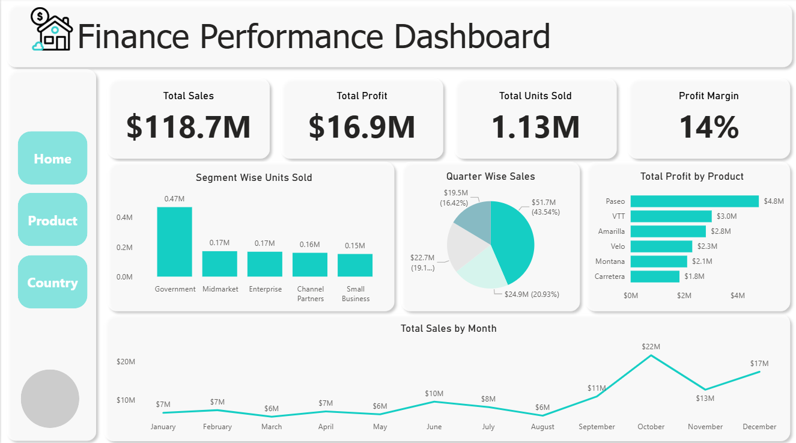
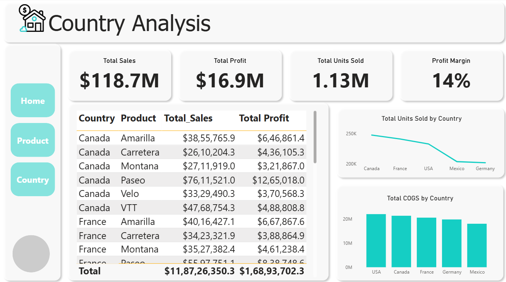
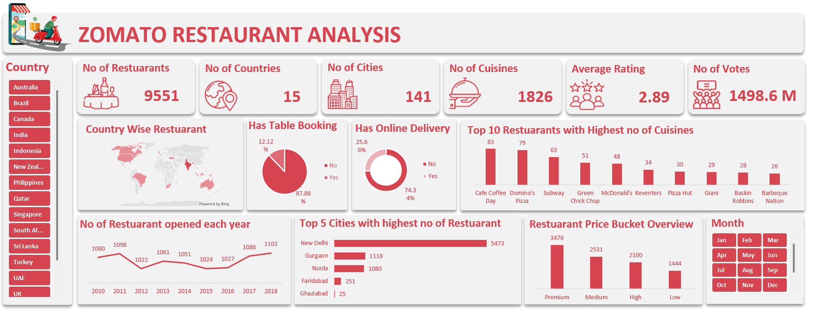

# Akshay Katigar
Data Analyst

  

Hi I’m **Akshay Katigar**, an aspiring Data Analyst with a BCA background currently pursuing a Data Analyst program at **Excelr**. I’m passionate about turning raw data into actionable business insights through clean analysis and effective visualization.  

## Contact
- **LinkedIn:** https://www.linkedin.com/in/akshay-katigar  
- **Email:** akshaykatigar@gmail.com  

## Technical Skills
- **Data & Analysis:** Excel (Power Query), SQL, Pandas (Python)  
- **Visualization & BI:** Power BI, Tableau, Excel dashboards  
- **Other:** Basic Python, data cleaning, storytelling with data

## Projects

### Financial Dashboard
A fully interactive **Finance Performance Dashboard** built in **Power BI** to analyze company-wide sales, profit, units sold, and product-level performance.  
This dashboard helps stakeholders quickly understand financial KPIs, identify high-performing segments, and analyze trends across products and countries.

#### **1️⃣ Finance Overview**

  

#### **2️⃣ Product Analysis**

  

#### **3️⃣ Country Analysis**

  

## Key Insights & Highlights

### **Overall Finance Summary**
- **Total Sales:** $118.7M  
- **Total Profit:** $16.9M  
- **Total Units Sold:** 1.13M  
- **Profit Margin:** 14%  

### **Segment-Level Insights**
- Government segment contributed the **highest units sold (0.47M)**.
- Midmarket, Enterprise, and Channel Partners show moderate performance.
- Opportunities exist to increase sales in Small Business.

### **Product-Level Insights**
- **Paseo** is the highest revenue-generating product with **$4.8M profit**.
- Products like VTT & Amarilla also show strong contributions.
- Trend lines for **COGS vs Manufacturing Price** help monitor supply chain efficiency.

### **Country-Level Insights**
- USA and Canada lead with the highest unit sales.
- Germany and Mexico show lower volumes — potential for strategic growth.
- COGS distribution indicates stable cost structure across regions.

## Tools & Techniques Used
- **Power BI** – Modeling, DAX Measures, Data Visualization  
- **Power Query** – Data cleaning & transformation  
- **Data Modeling** – Relationships between Product, Country, and Sales tables  
- **Charts Used** – Bar charts, Line charts, Pie charts, Tree map, KPI cards  

## Features of the Dashboard
- Clear navigation panel (Home, Product, Country)  
- Professional KPI cards for quick decision-making  
- Trend lines for monthly sales performance  
- Interactive product-level profitability analysis  
- Country-level breakdown for targeted insights

## Business Impact
- Helps leadership track financial performance in real time  
- Supports product & country-level decision making  
- Easily identifies high-margin opportunities  
- Improves reporting efficiency by replacing manual Excel reports

## 📁 Project Files
- Power BI File: Finance Dashboard.pbix

### Zomato Restaurant Analysis

  

This project is a fully interactive Excel Dashboard created to analyze the global restaurant landscape using Zomato data.
The dashboard summarizes 9,551 restaurants across 15 countries, revealing customer behavior patterns, restaurant trends, cuisine diversity, and service availability.

## Objective of the Dashboard

- Understand restaurant distribution across countries & cities

- Analyze cuisine diversity

- Evaluate customer interaction through ratings & votes

- Study delivery & table booking availability

- Identify top-performing cities & restaurants

- Visualize pricing segments using Restaurant Price Buckets

# Key Insights
- Restaurant Distribution

- Cuisine & Customer Engagement

- Restaurant Services

- Top Restaurants by Cuisine Variety

- Price Bucket Analysis

- City-Wise Performance

- Yearly Trend

Restaurants opened per year show growth with the highest number (1102) in 2018.

Business Impact

- Identify countries & cities with the highest restaurant opportunities
- Prioritize markets for expansion
- Understand customer engagement patterns
- Evaluate food delivery and table booking trends
- Analyze pricing strategies through bucket segmentation
- Make data-driven decisions for growth

## 📁 Project Files
- Excel File: Zomato Excel Dashboard.xlsx

